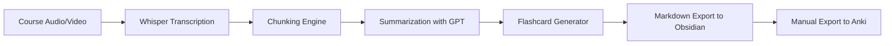

# Retention Pipeline  

## Description  
This project was born out of my need to make course learning more effective. Simply watching courses and passively absorbing information wasn’t enough — I needed a system where no important detail slipped by.  

The Retention Pipeline automates the process of turning **lectures into long-term memory**. It transcribes audio, summarizes content, and generates **Anki-ready flashcards** directly into my Obsidian vault. This makes studying not just faster, but far more **efficient and retention-focused**.  

---

## How it Works  

1. **Input a course** (downloaded file or live recording).  
2. **Transcription**: Whisper converts speech → text.  
3. **Chunking**: Long transcripts are split into manageable sections.  
4. **Summarization**: Each chunk is summarized into readable notes (via GPT-4o-mini).  
5. **Flashcard Generation**: Summaries are converted into structured Q/A or Cloze flashcards.  
6. **Export**: Flashcards are written into Markdown using the **Obsidian to Anki plugin format**.  



---

## Tech Stack  
- **Python 3.11+**  
- [Whisper](https://github.com/openai/whisper) or [whisper.cpp](https://github.com/ggerganov/whisper.cpp) for transcription  
- [OpenAI API](https://platform.openai.com/) (GPT-4o-mini for summaries + flashcards)  
- [Typer](https://typer.tiangolo.com/) for CLI  
- [Obsidian](https://obsidian.md/) + [Obsidian-to-Anki plugin](https://github.com/Pseudonium/Obsidian_to_Anki) for flashcard workflow  

---


## Example  

**Input**: 5-min lecture audio clip  
**Output**:  

```markdown
START
Basic
Front: What does dropout do in neural networks?
Back: Randomly disables activations during training to reduce overfitting and encourage generalization.
Tags: deep-learning,regularization
END
```

---

## Potential Challenges  
- **Audio access**: Some platforms (e.g. Udemy) protect course streams. Solution: use `yt-dlp` or manual recording.  
- **Long sections**: One-hour lectures may exceed token limits → requires chunking strategy (sliding windows, semantic segmentation).  
- **Cost**: Frequent API calls can be expensive; future work includes adding local models (Ollama, whisper.cpp).  

---

##  Roadmap  
- [ ] Transcription pipeline (Whisper)  
- [ ] Summarization prototype  
- [ ] Flashcard generation (Basic + Cloze)  
- [ ] Obsidian export  
- [ ] CLI wrapper (`retention run …`)  
- [ ] Evaluation (coverage, card quality, Bloom tags)  
- [ ] Local LLM backend option  

---

## Demo Screenshots  
*(to be added after MVP)*  
- Obsidian notes generated from lecture  
- Flashcards in Anki  

---
