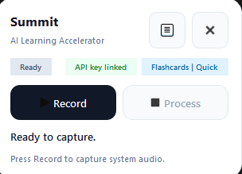
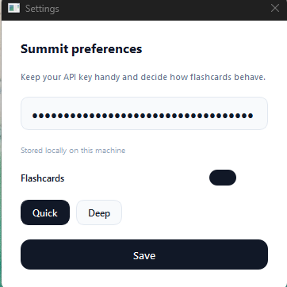
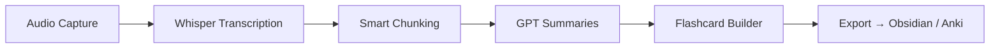

# Summit - AI Learning Accelerator

> Accelerate your learning by capturing, summarising, and revising every session with the help of AI.

[](https://python.org)
[](https://pypi.org/project/PySide6/)
[](https://openai.com)

## Overview

Summit - AI Learning Accelerator turns every lecture, meeting, or webinar into concise notes and ready-to-study flashcards. Capture audio, generate rich summaries, and build spaced-repetition material in minutes.

### Highlights
- **Capture & Transcribe** audio with Whisper for accurate speech-to-text.
- **Summarise Intelligently** using GPT-4o-mini to pull out key insights.
- **Generate Flashcards** (quick or deep modes) for Obsidian/Anki workflows.
- **Modern Desktop Experience** built with PySide6 for a minimal Loom-like feel.

## Quick Start

### Requirements
- Windows 10/11
- Python 3.11+
- OpenAI API key

### Installation
```bash
git clone https://github.com/yourusername/summit-ai-learning-accelerator.git
cd summit-ai-learning-accelerator
pip install -r requirements.txt
python run_gui.py
```

### Using the App
1. Launch the app and when prompted paste your **OpenAI API key**.
2. Press **Record** to capture your session.
3. Press **Process** to transcribe, summarise, and generate flashcards.
4. Review outputs inside the `data/` directory (summaries & flashcards only; intermediate files are discarded automatically).

## Screenshots

### Main Interface


### Settings Page


## How It Works


## Structure
```
summit-ai-learning-accelerator/
├── retention/                  # Core package (will be renamed later)
│   ├── gui/                    # PySide6 interface
│   │   ├── windows/            # Main window, settings, API key splash
│   │   ├── components/         # Reusable widgets
│   │   └── utils/              # Styling helpers
│   ├── asr/                    # Audio capture & Whisper wrappers
│   ├── nlp/                    # Summaries, flashcards, chunking
│   ├── recording/              # System audio access
│   └── validation.py           # Input & configuration validation
├── data/                       # Generated summaries & flashcards
├── build_exe.py                # PyInstaller helper
├── retention_pipeline.spec     # PyInstaller spec file
└── run_gui.py                  # Desktop entry point
```

## Tech Stack
| Layer | Technology | Purpose |
|-------|------------|---------|
| GUI | PySide6 | Minimal desktop experience |
| Transcription | OpenAI Whisper | High-quality audio to text |
| Summaries | GPT-4o-mini | Key insight extraction |
| Flashcards | Custom prompts | Quick & deep study material |
| Styling | Qt stylesheets | Cohesive light theme |

## Roadmap
- [x] GUI polish & minimal control surface
- [x] Automated flashcard generation
- [x] Clean build pipeline for Windows executables
- [ ] Batch processing for multiple recordings
- [ ] Customisable prompt templates
- [ ] Optional offline model support

## Contributing
1. Fork the repo
2. Create a branch (`git checkout -b feature/amazing-idea`)
3. Commit with context (`git commit -m "Add amazing idea"`)
4. Push (`git push origin feature/amazing-idea`)
5. Open a Pull Request

## License
MIT License - see [LICENSE](LICENSE) for details.

---
Built to help you summit every learning challenge.
